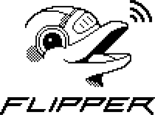

# Flipper Zero Collection 🐬

A personal collection of files, tools, and resources for my Flipper Zero — everything I’d need to quickly restore my device if I ever lost all my data.

## About ⚡

This repository serves as my personal backup for essential files, configurations, payloads, and other useful resources tailored for my Flipper Zero. Whether I’m setting up a new device or recovering from data loss, this collection ensures I have everything I need in one place.

## Contents 📂

### Signal & Data Files
- **Sub-GHz Files** (12 files + playlists) – Ceiling fan controls, gate/garage openers, Tesla charge port, and playback playlists
- **Infrared (IR) Files** (7 files) – Universal TV database and various remote controls
- **NFC Files** (48 files) – Fun troll tags, Amiibo, examples (Mifare Classic, NTAG, UID), and HID iClass
- **RFID Files** (3 files) – EM Marine, HID Prox, and Indala examples
- **iButton Files** (3 files) – Cyfral, Dallas/Maxim, and Metakom protocol keys
- **Music Files** (9 files) – Flipper Music Format songs including national anthems and popular themes

### Scripts & Applications
- **BadUSB Scripts** (8 scripts) – Demo scripts, pranks, and utilities (Windows/macOS)
- **Applications** (169 .fap files) – Games, GPIO tools, and various Flipper applications

### Additional Resources
- **Firmware & Configs** – Preferred firmware versions and configuration files
- **Documentation** – READMEs with usage instructions, protocol info, and safety warnings
- **Misc Tools & Scripts** – Other files for exploration, experimentation, and fun

### Total Collection
- **82 signal/data files** across 6 categories
- **8 BadUSB scripts** for automation and testing
- **169 compiled applications** ready to use
- **Comprehensive documentation** for all file types

## Why This Exists 🐬

The Flipper Zero is a versatile tool, but losing your carefully curated files can be a pain. This repo acts as my **personal vault**, ensuring I always have access to my must-have files — anytime, anywhere.

## Official Flipper Zero Website 🌐

For more information about the Flipper Zero device, check out the official website:  
🔗 [flipperzero.one](https://flipperzero.one/)

## Disclaimer ⚠️

This repository is intended for **personal backup and educational purposes only**. Use responsibly and within the bounds of the law.
